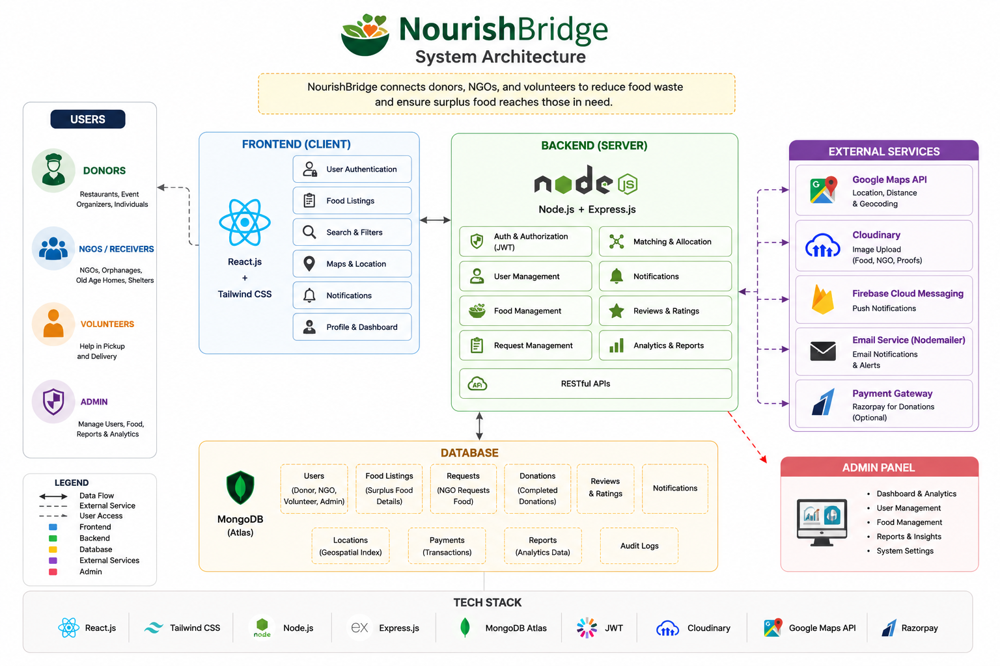

### 1. Introduction

This document describes the overall system architecture of **NourishBridge – Connecting Food. Nourishing Lives. A Smart Food Redistribution Platform**. It provides a high-level view of how different components of the system interact with each other, including the frontend, backend, database, and external services.

The purpose of this document is to establish a clear architectural foundation before implementation begins, ensuring that the system is scalable, secure, maintainable, and easy to understand throughout the development lifecycle.

# 2. Architecture Overview

NourishBridge follows a Three-Tier Architecture that separates the application into three independent layers:

### Presentation Layer

The Presentation Layer represents the user interface of the application. It is developed using React.js and Tailwind CSS, providing an interactive and responsive experience for donors, NGOs, volunteers, and administrators.

### Application Layer

The Application Layer contains the business logic of the system. It is developed using Node.js and Express.js, which process user requests, manage authentication, validate data, and communicate with the database.

### Data Layer

The Data Layer is responsible for storing and managing application data. MongoDB Atlas is used as the cloud-based NoSQL database to store user information, donation details, NGO records, volunteer data, and notifications securely.

# 3. High-Level System Architecture

The above diagram illustrates the interaction between users, the frontend, backend, database, and external services.