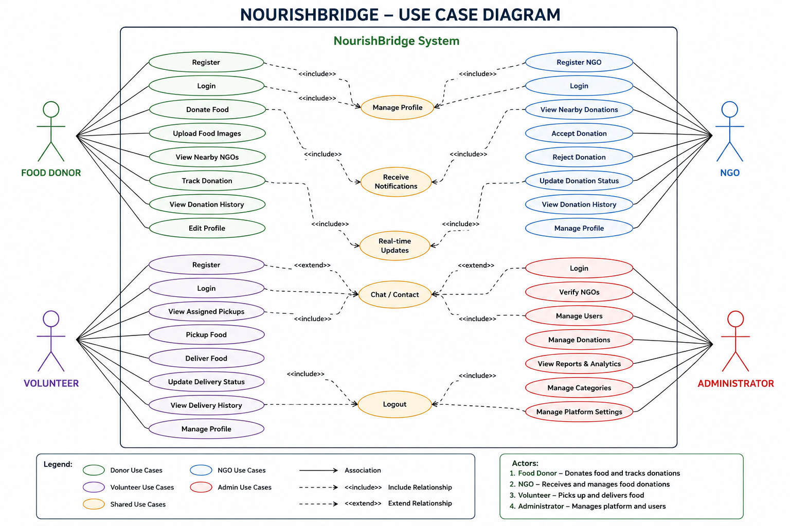

# 5. Use Case Diagram

# 5. Use Case Diagram

## 1. Introduction

The Use Case Diagram illustrates the interactions between different users (actors) and the NourishBridge system. It identifies the major functionalities available to each user and defines the scope of the application. This diagram provides a clear understanding of how different stakeholders interact with the platform to achieve the goal of efficient food redistribution.

---

## 2. Purpose

The purpose of the Use Case Diagram is to:

* Identify all users interacting with the system.
* Define the responsibilities of each actor.
* Visualize the system functionalities.
* Assist in designing the database, APIs, and user interface.
* Serve as a blueprint for application development.

---
## Use Case Diagram

## 3. Actors

### 3.1 Food Donor

A person or organization that donates surplus food.

Responsibilities:

* Register
* Login
* Donate Food
* Upload Food Images
* View Nearby NGOs
* Track Donation Status
* View Donation History
* Manage Profile

---

### 3.2 NGO

Organizations that receive food donations.

Responsibilities:

* Register NGO
* Login
* View Nearby Donations
* Accept Donation
* Reject Donation
* Update Donation Status
* View Donation History
* Manage Profile

---

### 3.3 Volunteer

Responsible for transporting food from donor to NGO.

Responsibilities:

* Register
* Login
* View Assigned Pickups
* Pick Up Food
* Deliver Food
* Update Delivery Status
* View Delivery History
* Manage Profile

---

### 3.4 Administrator

Responsible for managing the entire platform.

Responsibilities:

* Login
* Verify NGOs
* Manage Users
* Manage Donations
* View Reports & Analytics
* Manage Categories
* Manage Platform Settings

## 5. Use Case Description

The Food Donor can register, log in, create food donations, upload food images, locate nearby NGOs, and monitor donation progress.

NGOs can register, receive notifications of nearby donations, accept or reject donation requests, and update the donation status.

Volunteers are responsible for collecting food from donors and delivering it safely to NGOs while updating delivery progress.

Administrators oversee the entire system by verifying NGOs, managing users and donations, monitoring analytics, and maintaining platform settings.

---

## 6. Benefits of the Use Case Diagram

* Clearly identifies all stakeholders.
* Defines the responsibilities of each actor.
* Helps developers understand application flow.
* Simplifies backend API planning.
* Assists in database design.
* Acts as a reference during implementation and testing.

---

## 7. Conclusion

The Use Case Diagram provides a high-level representation of user interactions within the NourishBridge platform. It serves as the foundation for system development by defining the functional behavior expected from each actor and guiding the implementation of the application's features.

