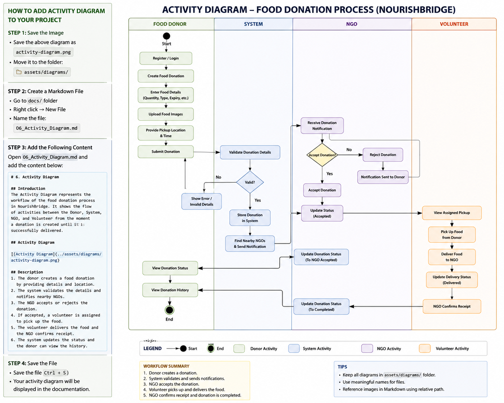

# 6. Activity Diagram

## 1. Introduction

The Activity Diagram illustrates the complete workflow of the NourishBridge platform. It describes how a food donation progresses from creation by the donor to successful delivery to an NGO. It also shows the interactions between the Food Donor, System, NGO, and Volunteer.

---

## 2. Purpose

The Activity Diagram is used to:

* Visualize the overall workflow of the system.
* Describe the sequence of activities performed by each actor.
* Identify decision points and system responses.
* Serve as a reference for backend and frontend development.

## 3. Activity Diagram

---
## 4. Workflow Description

### Step 1

The Food Donor registers or logs into the platform.

### Step 2

The donor creates a new food donation by entering details such as food type, quantity, expiry time, pickup location, and uploading food images.

### Step 3

The system validates the donation details.

### Step 4

If the information is valid, the donation is stored in the database and notifications are sent to nearby NGOs.

### Step 5

The NGO reviews the donation request.

### Step 6

If accepted, the donation status changes to **Accepted** and a volunteer is assigned.

### Step 7

The volunteer collects the food from the donor.

### Step 8

The volunteer delivers the food to the NGO.

### Step 9

The NGO confirms successful receipt.

### Step 10

The system updates the donation status to **Completed**, and the donor can view the donation history.

---

## 5. Benefits

* Clearly explains the complete donation workflow.
* Helps developers understand the business process.
* Serves as a guide for API development.
* Assists in designing frontend pages and backend logic.
* Simplifies testing and validation.

---

## 6. Conclusion

The Activity Diagram provides a detailed representation of the end-to-end food donation process in NourishBridge. It demonstrates how each actor collaborates with the system to ensure efficient and transparent food redistribution.

