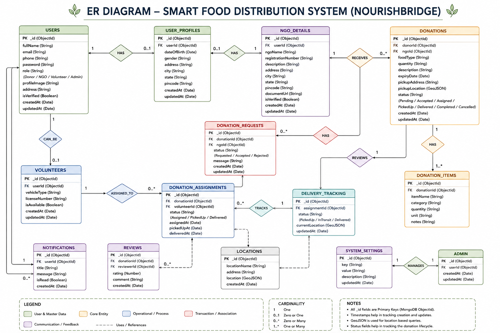

# 7. Entity Relationship (ER) Diagram

## 1. Introduction

The Entity Relationship (ER) Diagram represents the logical database structure of the NourishBridge system. It identifies the main entities, their attributes, and the relationships among them. This diagram serves as the foundation for designing the MongoDB database and implementing the backend.

---

# 2. Purpose

The ER Diagram is created to:

* Identify all database entities.
* Define the relationships between entities.
* Assist in MongoDB collection design.
* Reduce data redundancy.
* Improve database consistency and integrity.
* Serve as a reference during backend development.

---

# 3. ER Diagram

---

# 4. Entities

The NourishBridge database consists of the following primary entities:

### 4.1 User

Stores all registered users.

**Attributes**

* User ID
* Full Name
* Email
* Phone Number
* Password
* Role (Donor / NGO / Volunteer / Admin)
* Address
* Profile Image
* Created At
* Updated At

---

### 4.2 NGO

Stores NGO-specific information.

**Attributes**

* NGO ID
* User ID
* NGO Name
* Registration Number
* Description
* Address
* City
* State
* Pincode
* Verification Status

---

### 4.3 Donation

Stores food donation details.

**Attributes**

* Donation ID
* Donor ID
* NGO ID
* Food Type
* Quantity
* Description
* Expiry Time
* Pickup Address
* Pickup Location
* Status
* Created At

---

### 4.4 Donation Item

Stores individual food items included in a donation.

**Attributes**

* Item ID
* Donation ID
* Item Name
* Category
* Quantity
* Unit
* Notes

---

### 4.5 Volunteer

Stores volunteer information.

**Attributes**

* Volunteer ID
* User ID
* Vehicle Type
* Availability
* License Number

---

### 4.6 Donation Assignment

Stores volunteer assignment details.

**Attributes**

* Assignment ID
* Donation ID
* Volunteer ID
* Assignment Status
* Pickup Time
* Delivery Time

---

### 4.7 Delivery Tracking

Stores real-time delivery progress.

**Attributes**

* Tracking ID
* Assignment ID
* Current Location
* Delivery Status
* Updated Time

---

### 4.8 Notification

Stores notifications sent to users.

**Attributes**

* Notification ID
* User ID
* Title
* Message
* Read Status
* Created At

---

### 4.9 Review

Stores ratings and feedback after successful delivery.

**Attributes**

* Review ID
* Donation ID
* Reviewer ID
* Rating
* Comment

---

### 4.10 Admin

Stores administrator information.

**Attributes**

* Admin ID
* User ID
* Created At
* Updated At

---

# 5. Relationships

The relationships between entities are as follows:

* One User can create many Donations.
* One User can be associated with one NGO profile.
* One NGO can receive many Donations.
* One Donation can contain multiple Donation Items.
* One Donation can have one Volunteer Assignment.
* One Volunteer can handle multiple Donation Assignments.
* One Donation Assignment has one Delivery Tracking record.
* One User can receive multiple Notifications.
* One Donation can receive multiple Reviews.
* One Admin manages users, NGOs, and donations.

---

# 6. Database Design Considerations

The database is designed to:

* Reduce duplicate data.
* Maintain data consistency.
* Support scalable growth.
* Improve query performance.
* Enable efficient location-based searches using GeoJSON.
* Ensure secure user authentication.

---

# 7. Advantages of the ER Diagram

* Provides a clear visualization of database structure.
* Simplifies backend implementation.
* Improves API development.
* Makes debugging easier.
* Helps maintain database integrity.
* Supports future feature expansion.

---

# 8. Conclusion

The ER Diagram provides a complete representation of the NourishBridge database. It defines the entities, attributes, and relationships required to manage users, food donations, NGOs, volunteers, delivery tracking, notifications, and reviews efficiently. This design forms the foundation for implementing the MongoDB database and backend APIs.
