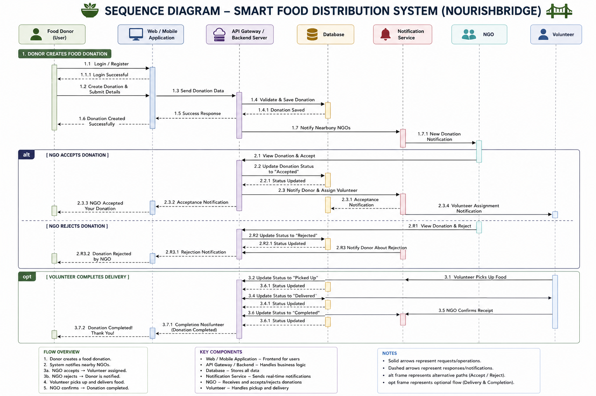

# 8. Sequence Diagram

## 1. Introduction

The Sequence Diagram illustrates the chronological interaction between different actors and system components in the NourishBridge platform. It shows how requests and responses flow between the Food Donor, Web Application, Backend Server, Database, Notification Service, NGO, and Volunteer.

---

## 2. Purpose

The purpose of the Sequence Diagram is to:

- Illustrate the communication between system components.
- Describe the order of operations during food donation.
- Assist developers in implementing backend APIs.
- Help understand request-response flow.
- Serve as a blueprint for system integration.

---

## 3. Sequence Diagram

---

## 4. Workflow Description

### Step 1
The Food Donor registers or logs into the application.

### Step 2
The donor creates a new food donation and submits food details.

### Step 3
The backend validates the information and stores the donation in MongoDB.

### Step 4
The Notification Service informs nearby NGOs about the new donation.

### Step 5
The NGO reviews the donation request.

### Step 6
If accepted, the donation status is updated and a volunteer is assigned.

### Step 7
The Volunteer collects the food from the donor.

### Step 8
The Volunteer delivers the food to the NGO.

### Step 9
The NGO confirms successful delivery.

### Step 10
The backend updates the donation status to "Completed" and notifies the donor.

---

## 5. Components

- Food Donor
- React Frontend
- Node.js Backend
- MongoDB Database
- Notification Service
- NGO
- Volunteer

---

## 6. Benefits

- Demonstrates request-response flow.
- Helps backend API implementation.
- Simplifies debugging.
- Improves system understanding.
- Supports future scalability.

---

## 7. Conclusion

The Sequence Diagram provides a clear representation of communication among different system components during the food donation lifecycle.