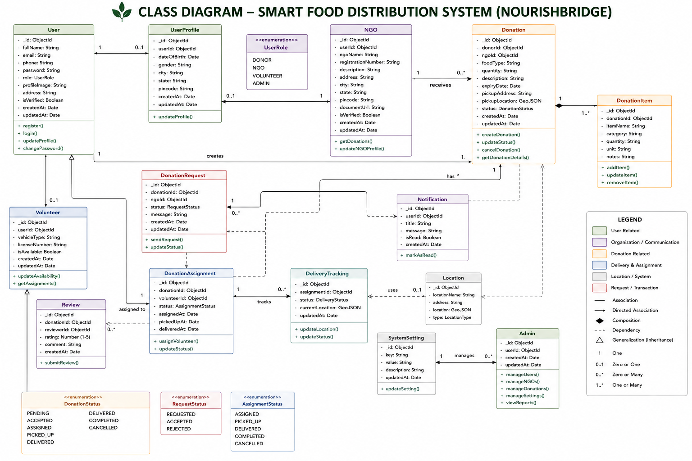

# 9. Class Diagram

## 1. Introduction

The Class Diagram represents the object-oriented design of the NourishBridge platform. It defines the classes, their attributes, methods, and relationships.

---

## 2. Purpose

The Class Diagram is used to:

- Design backend models.
- Represent system entities.
- Define object relationships.
- Support backend implementation.

---

## 3. Class Diagram

---

## 4. Major Classes

### User

Attributes

- userId
- fullName
- email
- password
- role
- phone

Methods

- register()
- login()
- updateProfile()

---

### NGO

Attributes

- ngoId
- ngoName
- registrationNumber
- address

Methods

- acceptDonation()
- rejectDonation()

---

### Donation

Attributes

- donationId
- foodType
- quantity
- expiryTime
- pickupLocation
- status

Methods

- createDonation()
- updateStatus()

---

### Volunteer

Attributes

- volunteerId
- vehicleType
- availability

Methods

- pickupFood()
- deliverFood()

---

### Notification

Methods

- sendNotification()
- markAsRead()

---

### Review

Methods

- submitReview()

---

## 5. Relationships

- User creates Donation.
- NGO receives Donation.
- Volunteer delivers Donation.
- Donation contains Donation Items.
- User receives Notifications.
- Donation has Reviews.

---

## 6. Advantages

- Supports object-oriented programming.
- Helps create Mongoose models.
- Simplifies backend development.
- Improves code maintainability.

---

## 7. Conclusion

The Class Diagram serves as the object-oriented blueprint for implementing the NourishBridge backend.