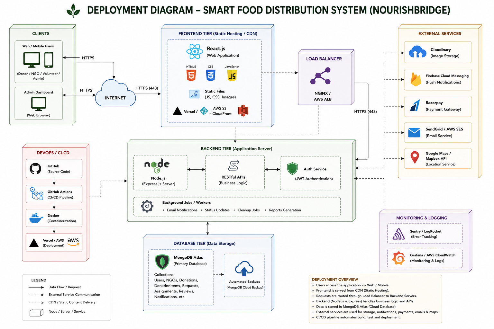

# 10. Deployment Diagram

## 1. Introduction

The Deployment Diagram illustrates the physical architecture of the NourishBridge platform. It shows how the application components are deployed across servers and cloud services.

---

## 2. Purpose

The Deployment Diagram helps to:

- Understand system deployment.
- Visualize server communication.
- Plan cloud infrastructure.
- Improve scalability.

---

## 3. Deployment Diagram

---

## 4. Deployment Components

### Client Layer

- Web Browser
- Mobile Browser

---

### Frontend Layer

- React.js
- HTML
- CSS
- JavaScript
- Tailwind CSS

Hosted on:

- Vercel

---

### Backend Layer

- Node.js
- Express.js
- REST APIs
- JWT Authentication

Hosted on:

- Render / Railway / AWS EC2

---

### Database Layer

- MongoDB Atlas

Collections

- Users
- NGOs
- Donations
- Volunteers
- Notifications

---

### External Services

- Google Maps API
- Cloudinary
- Firebase Cloud Messaging
- Email Service

---

## 5. Deployment Workflow

1. User accesses the application through a web browser.
2. Requests are sent to the frontend.
3. The frontend communicates with backend APIs.
4. The backend processes requests.
5. MongoDB stores and retrieves data.
6. External services provide notifications, maps, and image storage.
7. The response is returned to the user.

---

## 6. Advantages

- Scalable architecture.
- Cloud deployment.
- Secure communication.
- High availability.
- Easy maintenance.

---

## 7. Conclusion

The Deployment Diagram demonstrates how NourishBridge components are deployed and interact within a cloud-based environment.